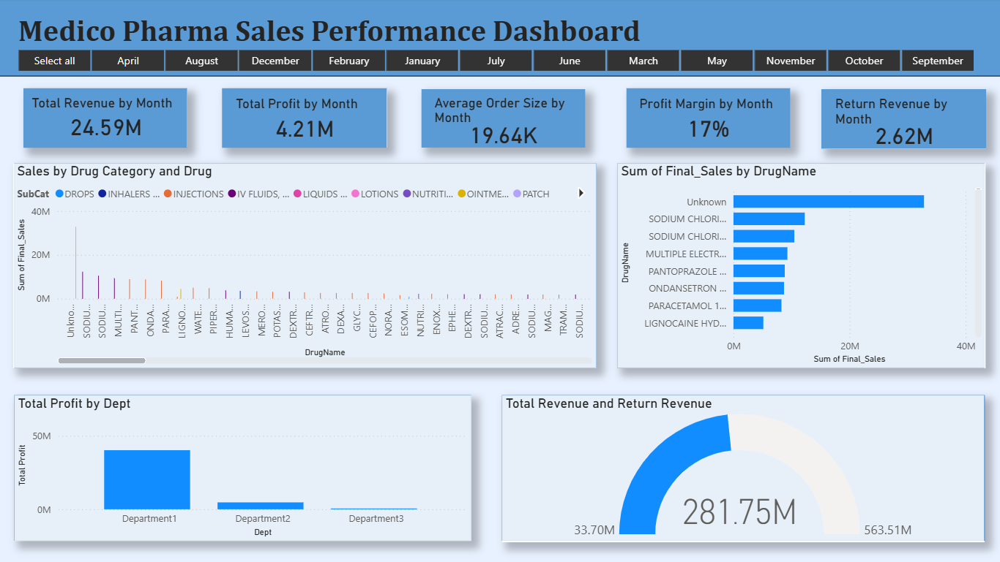

# 📊 Power BI Dashboard Portfolio

This repository contains multiple interactive dashboards created using **Power BI** to analyze business and pharmaceutical data.
These projects demonstrate skills in data cleaning, visualization, KPI tracking, and business insights.

---

# 🖼️ Dashboard 1: Pharma Sales Dashboard

## Overview

The Pharma Sales Dashboard analyzes revenue, cost, profit, and delivery performance across regions and product categories.

## Key KPIs

* Total Revenue
* Total Cost
* Profit
* Profit Margin
* On-Time Delivery Rate
* Year-to-Date Revenue

## Tools Used

* Power BI
* Power Query
* DAX
* Excel / CSV

---

# 🖼️ Dashboard 2: (Manufacturing Performance Analysis)

## Overview

This dashboard provides insights into business performance using interactive charts and KPIs. It helps track trends, measure efficiency, and support data-driven decisions.

## Key KPIs

* Total Revenue / Total Employees / Total Orders (edit as needed)
* Profit or Attrition Rate
* Performance Metrics
* Monthly or Yearly Trends

## Tools Used

* Power BI
* Data Cleaning
* Data Visualization
* Dashboard Design

---

## 📂 Files Included

* Dashboard1.pbix
* Dashboard2.pbix
* dataset.csv
* README.md

---

## 👤 Author

**Parthraj Paija**
MBA Student | Digital Marketing & Data Analytics

LinkedIn: www.linkedin.com/in/parthraj-paija
